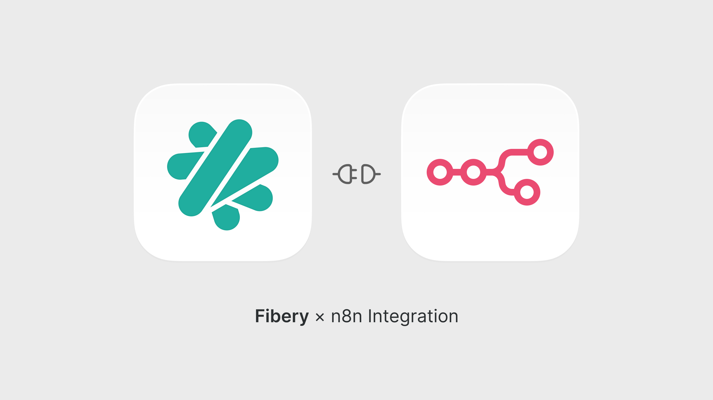

# n8n-nodes-fibery

This is an n8n community node. It lets you use Fibery in your n8n workflows.

Fibery is your company’s operating system
It's a work platform that replaces scattered tools and connects teams. Chosen by nerds, appreciated by everyone (almost).

[n8n](https://n8n.io/) is a [fair-code licensed](https://docs.n8n.io/reference/license/) workflow automation platform.

[Installation](#installation)
[Operations](#operations)
[Credentials](#credentials)
[Compatibility](#compatibility)
[Usage](#usage)
[Resources](#resources)
[Version history](#version-history)

## Installation

Follow the [installation guide](https://docs.n8n.io/integrations/community-nodes/installation/) in the n8n community nodes documentation.

1. Go to **Settings** > **Community Nodes**.
2. Select **Install**.
3. Enter `@fibery/n8n-nodes-fibery` in **npm Package name**.
4. Agree to the [risks](https://docs.n8n.io/integrations/community-nodes/risks/) of using community nodes: select **I understand the risks of installing unverified code from a public source**.
5. Select **Install**.

## Operations

### Database

- **get many**. List all databases in the workspace.

### Entity

- **create**. Create a new entity.
- **delete**. Delete an entity.
- **get**. Get an entity.s
- **get many**. Search and list entities from a database.
- **update**. Update an entity.

### Triggers

- **default**. Handle Fibery events to Database from webhooks.

## Credentials

At the moment this node supports only one authentication method: **API Key**.

### Using API Key

1. Enter the name of your Fibery workspace in the **Workspace** field. It can be obtained from the URL of your workspace. For example, if your workspace URL is `https://my-company.fibery.io`, then the workspace name is `my-company`.
2. Obtain an API key from your Fibery workspace. Please follow the [Fibery API keys](https://the.fibery.io/@public/User_Guide/Guide/Fibery-API-keys-252) guide.
3. Enter API key in the **API Key** field.

## Compatibility

Tested on: 1.111.0

## Resources

- [n8n community nodes documentation](https://docs.n8n.io/integrations/#community-nodes)
- [Fibery](https://www.fibery.io/)
- [Fibery API documentation](https://the.fibery.io/@public/User_Guide/Guide/Fibery-API-overview-279)
