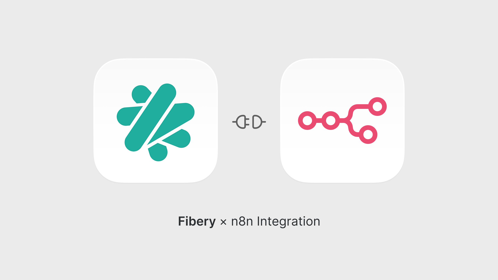

# n8n-nodes-fibery

This is an n8n community node. It lets you use Fibery in your n8n workflows.

Fibery is your company’s operating system
It's a work platform that replaces scattered tools and connects teams. Chosen by nerds, appreciated by everyone (almost).

[n8n](https://n8n.io/) is a [fair-code licensed](https://docs.n8n.io/reference/license/) workflow automation platform.

[Installation](#installation)
[Operations](#operations)
[Credentials](#credentials)
[Compatibility](#compatibility)
[Usage](#usage)
[Resources](#resources)
[Version history](#version-history)

## Installation

Follow the [installation guide](https://docs.n8n.io/integrations/community-nodes/installation/) in the n8n community nodes documentation.

1. Go to **Settings** > **Community Nodes**.
2. Select **Install**.
3. Enter `@fibery/n8n-nodes-fibery` in **npm Package name**.
4. Agree to the [risks](https://docs.n8n.io/integrations/community-nodes/risks/) of using community nodes: select **I understand the risks of installing unverified code from a public source**.
5. Select **Install**.

## Operations

### Database

- **get many**. List all databases in the workspace.

### Entity

- **create**. Create a new entity.
- **delete**. Delete an entity.
- **get**. Get an entity.
- **get many**. Search and list entities from a database.
- **update**. Update an entity.

### Triggers

- **default**. Handle Fibery events to Database from webhooks.

## Credentials

At the moment this node supports only one authentication method: **API Key**.

### Using API Key

1. Enter the name of your Fibery workspace in the **Workspace** field. It can be obtained from the URL of your workspace. For example, if your workspace URL is `https://my-company.fibery.io`, then the workspace name is `my-company`.
2. Obtain an API key from your Fibery workspace. Please follow the [Fibery API keys](https://the.fibery.io/@public/User_Guide/Guide/Fibery-API-keys-252) guide.
3. Enter API key in the **API Key** field.

## Compatibility

Tested on: 1.111.0

## Usage

This example creates a Fibery entity from an n8n workflow: add credentials, pick a database, set fields, and run the node.

### 1. Configure credentials

1. In n8n, open **Credentials** and create **Fibery API Key API**.
2. Set **Workspace** to the subdomain of your Fibery URL. For `https://my-company.fibery.io`, use `my-company`.
3. Paste an API key from [Fibery API keys](https://the.fibery.io/@public/User_Guide/Guide/Fibery-API-keys-252).
4. Save. n8n tests the key against `https://<workspace>.fibery.io/api/schema`.

### 2. Create an entity

1. Add a **Fibery** node to a workflow (for example after **Manual Trigger**).
2. Select the Fibery credentials from the previous step.
3. Set **Resource** to **Entity** and **Operation** to **Create**.
4. Choose a **Database** from the list, or enter its name (for example `Product Management/Feature`).
5. Under **Fields**, select **Add Field** and set values such as:
   - **Name**: `Ship n8n integration`
   - **State**: `Backlog`
6. Optionally set **Output** to **Simplified**, **Raw**, or **Selected Fields**.
7. Execute the node. The output item is the created entity, including its Fibery ID.

You can map values from earlier nodes with expressions, for example `{{ $json.title }}` for **Name**.

### 3. Query entities (Get Many)

To list matching records instead of creating one:

1. Set **Resource** to **Entity** and **Operation** to **Get Many**.
2. Choose the same **Database**.
3. Set **Limit** (default `50`).
4. Leave **Filter** as **None**, or choose **Build Manually** and add conditions (field, operator, value). Use **Must Match** to require all conditions (`AND`) or any condition (`OR`).
5. Execute the node. Each matching entity is returned as a separate item.

### 4. React to Fibery changes (optional)

Use **Fibery Trigger** to start a workflow when entities in a database change. Select the same credentials and database. Only Fibery admins can create the webhook.

## Resources

- [n8n community nodes documentation](https://docs.n8n.io/integrations/#community-nodes)
- [Fibery](https://www.fibery.io/)
- [Fibery API documentation](https://the.fibery.io/@public/User_Guide/Guide/Fibery-API-overview-279)

## Version history

The Fibery node is currently at version **1**. There are no previous node versions.

Package releases are listed in [CHANGELOG.md](./CHANGELOG.md). Current package version: **0.1.25**.
